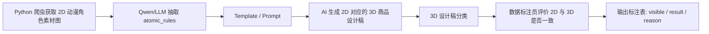

# 监修 VLM Atomic Rules 工作流

## 1. 核心目标

本工作流目标是构建一条面向动漫 IP 监修的 VLM 数据与标注流程：先从 2D 动漫角色素材中抽取角色的普遍视觉特征，再用这些特征生成 3D 商品设计稿，最后让数据标注员按统一标准判断 2D 角色设定与 3D 设计稿是否一致。

这里的 `atomic_rules` 指属性名称或角色特征，不是长文本审核规则。每条规则由 `id` 和 `value` 组成：

```json
{
  "id": "hair_color",
  "value": "blonde"
}
```

`id` / `rule_id` 表示要检查的角色特征，例如 `hair_color`、`left_eye_color`、`right_eye_color`、`head_accessory_type`、`body_signature_feature_type`。`value` 表示该特征在 2D 角色设定中的标准值，例如 `blonde`、`red`、`hairband`、`scar`。

## 2. 整体流程



这条链路中，`atomic_rules` 是 Qwen/LLM 从 2D 角色图中抽取出的角色标准特征；`template` 是把这些标准特征组织成生成 3D 设计稿的 prompt；标注阶段则只判断生成出的 3D 设计稿是否保留了这些 2D 特征。

## 3. Atomic Rules 规则体系

当前规则体系按可见范围分为 `head` 和 `body` 两大类，再向下拆为具体对象与小规则。这个划分适合当前动漫 IP 监修任务：头部类商品可以只检查头部规则，全身类商品则同时检查头部和身体规则。

最终输出保持扁平的 `id/value` 结构，不在 `atomic_rules.json` 中保留 `scope`、`category`、`confidence`、`evidence` 或其他辅助字段。

### 3.0 value 规范

`atomic_rules.value` 必须使用短标签，不允许加入程度副词或修饰性长描述。

- 长度、大小、程度类 value 只允许使用离散短值，例如 `short`、`medium`、`long`。
- 不允许输出 `very_long`、`slightly_long`、`extremely_long`、`super_long`、`a_bit_short` 这类带程度副词或主观修饰的值。
- 肤色相关 value 必须收敛到固定集合：`fair`、`tan`、`dark`。
- 不允许输出 `light`、`light_tan`、`brown`、`gray`、`pale`、`light_peach`、`warm_beige`、`dark_brown` 这类分散肤色值；需要先归并到固定集合后再输出。
- 如果视觉特征介于两个档位之间，选择更接近的一个标准档位；如果无法稳定判断，则不输出该条规则。
- 颜色、形状、配饰、标志性特征也应使用英文短值或 snake_case 短标签，例如 `red`、`blonde`、`twintails`、`ribbon`、`scar`，不要输出自然语言句子。

### 3.1 头部规则

头部规则用于描述角色头部、脸部和头发上稳定可见的视觉特征。

| 一级范围 | 二级对象 | 小规则 | 推荐 rule_id | 含义 |
| --- | --- | --- | --- | --- |
| `head` | 头发 | 长度 | `hair_length` | 只能使用 `short`、`medium`、`long` |
| `head` | 头发 | 形状/发型 | `hair_shape` | 直发、卷发、双马尾、单马尾、刘海、辫子等 |
| `head` | 头发 | 颜色 | `hair_color` | 头发主色或明显分区颜色 |
| `head` | 左眼 | 形状 | `left_eye_shape` | 左眼形状，如圆眼、细长眼、吊眼、特殊瞳孔形状等 |
| `head` | 左眼 | 颜色 | `left_eye_color` | 左眼主色 |
| `head` | 右眼 | 形状 | `right_eye_shape` | 右眼形状，如圆眼、细长眼、吊眼、特殊瞳孔形状等 |
| `head` | 右眼 | 颜色 | `right_eye_color` | 右眼主色 |
| `head` | 嘴 | 形状 | `mouth_shape` | 微笑、张嘴、猫嘴、尖牙外露等稳定嘴部特征 |
| `head` | 肤色 | 颜色 | `skin_color` | 只能使用 `fair`、`tan`、`dark` |
| `head` | 配饰 | 类型 | `head_accessory_type` | 后天添加在头部或脸部的物件，如面具、发箍、蝴蝶结、帽子、眼镜、耳饰等 |
| `head` | 配饰 | 颜色 | `head_accessory_color` | 头部配饰的主色 |
| `head` | 标志性面部符号 | 类型 | `face_signature_feature_type` | 角色先天或设定上固有的面部特征，如伤疤、痣、胎记、特殊纹路等 |
| `head` | 标志性面部符号 | 颜色 | `face_signature_feature_color` | 面部标志性特征的颜色 |
| `head` | 标志性面部符号 | 位置 | `face_signature_feature_position` | 位于左眼下、右脸颊、额头等 |

### 3.2 身体规则

身体规则用于描述头部以下的服装、身体配饰和角色固有身体特征。

| 一级范围 | 二级对象 | 小规则 | 推荐 rule_id | 含义 |
| --- | --- | --- | --- | --- |
| `body` | 衣服 | 形状/类型 | `outfit_shape` | 连衣裙、制服、斗篷、外套、短裤、长裤、盔甲等 |
| `body` | 衣服 | 颜色 | `outfit_color` | 服装主色或关键分区颜色 |
| `body` | 配饰 | 类型 | `body_accessory_type` | 后天添加在身体上的物件，如腰带、项链、手套、武器、背包、披风等 |
| `body` | 配饰 | 颜色 | `body_accessory_color` | 身体配饰的主色 |
| `body` | 标志性身体特征 | 类型 | `body_signature_feature_type` | 角色先天或设定上固有的身体特征，如翅膀、尾巴、角、机械手臂、特殊纹身、身体伤疤等 |
| `body` | 标志性身体特征 | 颜色 | `body_signature_feature_color` | 身体标志性特征的颜色 |
| `body` | 标志性身体特征 | 位置 | `body_signature_feature_position` | 位于背部、左手臂、胸口等 |

### 3.3 配饰与标志性特征的边界

`accessory` 和 `signature_feature` 的区别必须按角色设定判断：

- `accessory` 是后天添加、理论上可以取下或更换的外部物件，例如面具、发箍、帽子、眼镜、耳饰、项链、腰带、手套、武器、背包。
- `signature_feature` 是角色先天具有，或在角色设定中作为身体/面部固有特征存在的视觉符号，例如伤疤、痣、胎记、特殊纹路、角、尾巴、翅膀、机械义肢、身体纹身。
- 如果图像中无法判断某个元素是配饰还是固有特征，优先选择更保守、更可见的类别；如果仍不稳定，则不输出该条规则。

### 3.4 输出示例

```json
{
  "id": "head_accessory_type",
  "value": "hairband"
}
```

```json
{
  "id": "face_signature_feature_type",
  "value": "scar"
}
```

## 4. Step 1：从 2D 素材图抽取 atomic_rules

输入是通过 Python 爬虫获得的 2D 动漫角色素材图。Qwen/LLM 读取角色图后，直接抽取该角色普遍具有、后续需要在商品设计稿中保留的 `atomic_rules`。

当前采用最小产物原则：Qwen 可以自行判断图中有哪些值得监修的 atomic rules，但输出文件必须保持纯净，不写模型调试信息、置信度、证据或 metadata。

当前正式批次优先接受符合以下条件的图片：

- 必须是日本 IP 或明显日本 ACG 风格的 2D 角色图，例如日本动画、游戏、虚拟主播、偶像企划、VOCALOID、Fate、Touhou、Project Sekai、Idolmaster 等。
- 必须是彩色图，不能是黑白线稿、灰度图、草图、颜色信息不足的设定图。
- 优先选择类似设定集、reference sheet、character sheet、turnaround，或明确包含 `front`、`side`、`back` 三视图的图片。
- 如果是 `official_art + full_body + solo` 的官方单张全身图，也可以进入 Aniplex 监修批次，用于补充真实 IP 场景。
- 必须至少能稳定判断头部、服装和主要身体特征；只露头、半身、严重裁切、被遮挡过多的图不进入正式批次。
- 明显西方 IP、欧美漫画风、写实照片、星球大战/漫威/DC 等非日本动漫 IP 风格图片必须剔除。
- 角色固有的兽耳、角、翅膀、尾巴、尖耳等不再作为硬剔除条件；这类特征应进入 `body_signature_feature_type` 或对应短规则。

推荐输出为 `<sample_id>_atomic_rules.json`：

```json
{
  "code": "5524-715503163",
  "atomic_rules": [
    { "id": "hair_style", "value": "segmented_tied_hair" },
    { "id": "hair_length", "value": "long" },
    { "id": "hair_color", "value": "blonde" },
    { "id": "has_folding_fan", "value": true },
    { "id": "folding_fan_color", "value": "red" },
    { "id": "has_yin_yang_symbol", "value": true },
    { "id": "yin_yang_symbol_position", "value": "lower_skirt" }
  ]
}
```

这一阶段只负责得到 2D 角色的标准特征，不判断 3D 设计稿是否正确。

每个样本文件夹仿照 `vlm/data/raw_trials` 中的试标结构，保持最小文件集：

```text
<sample_id>_original.jpg / <sample_id>_original.png
<sample_id>_atomic_rules.json
```

不写模型调试文件或其他旁路文件。

当前脚本层只保留一条主线：

- `vlm/scripts/crawl_safebooru.py`：默认使用 `aniplex_supervision_strict` preset，爬取日本 ACG / Aniplex 监修场景中的彩色 2D 单人角色素材，优先设定图、多视图图，也允许官方单张全身图；旧的 `japanese_anime_turnaround_strict` preset 仍保留。
- `vlm/scripts/extract_atomic_rules_with_qwen.py`：对爬取到的图片做 smoke test 或小批量 atomic_rules 抽取，输出最小样本文件夹。
- `vlm/scripts/compare_raw_trials_with_qwen.py`：对 `vlm/data/raw_trials` 中的既有 `atomic_rules` 与 Qwen 结果做对比，并输出 markdown 报告。

当前推荐的 Safebooru 爬取命令为：

```powershell
.\.venv\Scripts\python.exe .\vlm\scripts\crawl_safebooru.py `
  --view-preset aniplex_supervision_strict `
  --limit 180
```

如果需要复现旧的通用严格设定图批次，可显式指定：

```powershell
.\.venv\Scripts\python.exe .\vlm\scripts\crawl_safebooru.py `
  --view-preset japanese_anime_turnaround_strict `
  --limit 180
```

当前推荐的 Step 1 命令为：

```powershell
.\.venv\Scripts\python.exe .\vlm\scripts\extract_atomic_rules_with_qwen.py `
  --metadata .\vlm\data\safebooru_2d\japanese_anime_turnaround_pilot_20\metadata.jsonl `
  --out-dir .\vlm\data\safebooru_2d\japanese_anime_turnaround_pilot_20\atomic_rules `
  --model qwen3.5-plus `
  --limit 15 `
  --image-source url `
  --sleep 0.5 `
  --overwrite
```

正式 Qwen/VLM 流程只保留纯净 `atomic_rules`，每条规则只包含 `id` 和 `value`，不再保留旧的 tag baseline 脚本。

### 4.1 Atomic Rules 后处理：补颜色与细节 counterpart

当 QA 或结构化审计发现某些规则只描述“存在”或“类型”，但缺少颜色、渐变、图案等可见 counterpart 时，不应默认整份重抽所有 `atomic_rules`。推荐优先使用 patch-only 后处理：

- 保留已有 `<sample_id>_atomic_rules.json`，只追加新规则。
- 输入 2D 原图、已有 `atomic_rules` 和 audit CSV 中该 sample 的缺失项。
- Qwen 只返回 `new_atomic_rules`，脚本 merge 后原地写回既有 JSON。
- 不删除、不重命名、不覆盖已有规则；如果旧规则本身错误，再单独 QA 或整份重抽。
- 颜色、渐变、图案仍必须来自 2D 图可见内容，不能根据物体常识补色。例如 `bell` 不能默认补 `gold/yellow`。

当前 patch-only 脚本：

```powershell
.\.venv\Scripts\python.exe .\vlm\scripts\patch_atomic_rules_from_audit_with_qwen.py `
  --metadata .\vlm\data\safebooru_2d\japanese_anime_turnaround_pilot_20\metadata.jsonl `
  --atomic-dir .\vlm\data\safebooru_2d\japanese_anime_turnaround_pilot_20\atomic_rules `
  --audit-csv .\vlm\data\safebooru_2d\japanese_anime_turnaround_pilot_20\reports\atomic_rules_missing_color_or_detail_audit.csv `
  --model qwen3.5-plus `
  --image-source url `
  --workers 6 `
  --sleep 0.5 `
  --retries 2 `
  --retry-base-sleep 2 `
  --limit-samples 30
```

如果 smoke test 通过，去掉 `--limit-samples 30` 全量处理 audit CSV 覆盖的样本。

由于爬虫范围已经扩展到 Aniplex 监修场景，Qwen prompt 需要继续兼容：

- 官方单张全身图：不是多视图设定图时，也继续抽取可见且稳定的角色核心特征。
- 角色固有非人类特征：兽耳、角、翅膀、尾巴、尖耳等不要视为图片无效，也不要误归为普通配饰。
- 监修关键特征优先：发色、发型、眼色、肤色、头饰、服装主类型/主色、标志性身体特征、图案和手持物优先；鞋袜、袖长、裙摆 trim 等普通局部细节不要过度拆碎。

当前 `qwen3.5-plus` prompt、canonical 对齐逻辑和 `aniplex_supervision_strict` 爬虫规则固定为 `v1-candidate`。该版本可用于 30-50 张新图 smoke batch，但不建议直接投入大量图片生产。新图没有原始 `atomic_rules` 可对比，因此需要人工质检，而不是继续自动算重合度。

新图人工质检建议字段：

```csv
sample_id,json_valid,core_features_complete,too_fragmented,wrong_category,value_normalized,usable,notes
```

建议验收门槛：

- `json_valid = 100%`
- `usable >= 80%`
- 严重漏核心特征 <= 10%
- 过度拆碎 <= 20%
- 分类错误 <= 15%

## 5. Step 2：用 template 生成多品类 3D 商品设计稿

`template` 本质上是 prompt 模板，用来把 2D 原图、`atomic_rules` 和商品类型输入给 AI，使其生成对应角色的 3D 商品设计稿。template 不负责创造新角色特征，只负责把已有的视觉特征稳定地组织成生成指令。

当前流程不应只生成 PVC 手办。二创周边包括全身手办、Q 版公仔、蛋糕卷、头部挂饰、痛包、背包等多种形态，不同商品形态天然可见的规则不同。因此 Step 2 需要采用“通用母模板 + 商品类型 product block”的方式：

```text
IMAGE 1 HAS HIGHEST PRIORITY FOR ALL CHARACTER IDENTITY DETAILS.

Use the provided 2D anime character image as the primary visual identity reference.
Use atomic_rules as mandatory reinforcement constraints.

PRODUCT TYPE:
{{PRODUCT_TYPE}}

PRODUCT SCOPE:
{{PRODUCT_SCOPE}}

PRODUCT-SPECIFIC REQUIREMENTS:
{{PRODUCT_BLOCK}}

MANDATORY ATOMIC_RULES:
{{ATOMIC_RULES}}

RULE VISIBILITY POLICY:
{{RULE_VISIBILITY_POLICY}}
```

当前 prompt 资产：

- `vlm/prompts/generation/wan_3d_figurine_from_atomic_rules.txt`：PVC 手办三视图模板，当前脚本默认使用。
- `vlm/prompts/generation/wan_3d_merchandise_from_atomic_rules.txt`：多品类周边母模板，已预留 `PRODUCT_TYPE`、`PRODUCT_SCOPE`、`PRODUCT_BLOCK`、`RULE_VISIBILITY_POLICY` 等占位符，后续需要脚本填充。

### 5.1 商品类型分层

建议先按“监修能力覆盖”分层，而不是按商品品类平均分配：

| 商品层级 | 示例 | 主要覆盖能力 |
| --- | --- | --- |
| 全身高保真类 | PVC 手办、站姿全身公仔 | 头部、服装、腿袜、鞋、背部、手持物、全身配色 |
| 全身 Q 版/变形类 | Q 版公仔、毛绒全身公仔、坐姿公仔 | 比例压缩后的角色识别、核心发型/服装/配色保留 |
| 头部/局部类 | 蛋糕卷、头部挂饰、头部毛绒挂件 | 发型、发色、眼睛、头饰、脸部标志 |
| 商品载体/强变形类 | 痛包、背包、装饰挂件、容器类周边 | 角色元素映射、图案化、局部装饰、颜色分布、标志性元素 |

第一批 100 张 pilot 可按以下比例：

```text
PVC 手办：30
Q 版公仔：20
蛋糕卷：12
头部挂饰：13
痛包：15
背包/其他载体：10
```

不要让每个角色都生成所有品类。建议大多数角色只生成 1 个商品类型，部分角色生成 2 个商品类型，少量核心角色生成 3-4 个商品类型，用于观察同一角色跨品类的一致性。

### 5.2 商品类型选择原则

- 如果角色有大量身体、服装、腿袜、鞋、背饰、手持物规则，优先分配到全身类商品。
- 如果角色头发、眼睛、头饰、脸部标志很突出，但身体信息弱，可以分配到头部挂饰、蛋糕卷等局部商品。
- 如果角色有强图案、渐变色、手持物、背饰、左右不对称、标志性符号，适合分配到痛包、背包、装饰挂件等强商品化载体，用来测试角色元素映射能力。
- 如果某个品类在小样本中失败率很高，先降低占比，优先稳定 prompt 和标注标准。

### 5.3 颜色和图案保真

`atomic_rules` 中的颜色短标签只表示粗粒度约束，不能替代 2D 原图中的颜色分布。生成 prompt 必须要求：

- 保留 2D 图中可见的局部颜色分区、渐变、半透明变化、高光、金属色偏、图案、符号和装饰线。
- 不把多色、渐变、图案小物件压成单一纯色。
- 如果 `atomic_rules` 写的是 `blue/cyan` 这类组合或色系标签，应将其视为最低色系约束，具体色相分布、渐变和图案仍以 2D 图为准。
- 特别关注手持物、头饰、发饰、蝴蝶结、背饰、腿袜、鞋、装饰面板等小但定义角色身份的元素。

这一阶段的产物是 3D 商品设计稿，可以是 AIGC 生成图，也可以是后续 3D design 流程中的设计图。正式样本目录仿照 raw trial 结构，只保留 2D 原图、3D 图和 `atomic_rules.json` 三件套。

## 6. Step 3：对 3D 设计稿做商品范围分类

生成 3D 设计稿后，需要先按商品图覆盖的角色范围做分类。分类的作用是决定后续标注员应该检查哪些 `atomic_rules`，以及哪些规则天然不可见、不应参与错误判断。

当前建议使用以下 `product_scope`：

| product_scope | 含义 | 示例小类 | 主要检查规则 |
| --- | --- | --- | --- |
| `full_body` | 呈现完整或大部分角色身体 | PVC 手办、全身毛绒、Q 版全身公仔 | 头部、服装、身体配饰、背饰、腿袜、鞋、手持物 |
| `head_only` | 主要呈现头部或脸部，不包含完整身体 | 头部挂饰、蛋糕卷、头部毛绒 | 头发、眼睛、嘴、肤色、头饰、脸部标志 |
| `carrier_mapped` | 角色被映射到商品载体，不一定出现完整人物 | 痛包、背包、容器、装饰挂件 | 主色、图案、符号、配饰映射、头部/服装的可见装饰元素 |
| `hybrid` | 同时包含商品载体和小型角色组件 | 带头部挂件的背包、带角色 charm 的痛包 | 按可见区域分别检查 head/body/mapped 规则 |

规则可见性原则：

- `full_body` 商品可检查头部和身体规则，但仍以视角可见为准。
- `head_only` 商品不强行检查服装、腿袜、鞋、完整身体配饰，除非这些元素被明确改造成可见装饰。
- `carrier_mapped` 商品不要求完整人物结构，但要检查角色主色、标志性图案、配饰符号、发型/头饰轮廓等是否被合理映射。
- `hybrid` 商品按区域判断：小角色组件按人物规则检查，商品载体按映射规则检查。
- 如果某条规则在当前商品类型中天然不可见，应在对应视角中标为不可见，不参与正确性判断。

## 7. Step 4：标注员评价 2D 与 3D 是否一致

数据标注员需要成对查看 2D 角色图和 3D 设计稿，并沿用 PDF 标注规范中的评价标准。每一行表示一个角色的一条 `atomic_rule` 在 3D 设计稿中是否可见，以及是否符合 2D 标准。

固定字段如下：

| 字段 | 含义 |
| --- | --- |
| `sample_id` | 样本 ID，同一角色或同一组 2D/3D 对应关系保持一致 |
| `rule_id` | 属性名称，即 `atomic_rules.id` |
| `value` | 2D 角色中的标准值，即 `atomic_rules.value` |
| `front` | 该规则在正面视角是否可见、可判断 |
| `side` | 该规则在侧面视角是否可见、可判断 |
| `back` | 该规则在背面视角是否可见、可判断 |
| `result` | 3D 设计稿是否符合该条规则，只能填 `correct` 或 `wrong` |
| `reason` | 当 `result = wrong` 时填写错误类型 |

可见性填写原则：

- 能明确看到，填 `TRUE`
- 被遮挡、看不到、无法判断，填 `FALSE`
- 不要猜测不可见区域

`result` 判断原则：

- 只在至少一个可见视角中判断是否正确
- 不可见视角不参与错误判断
- `result = correct` 时，`reason` 必须留空
- `result = wrong` 时，`reason` 必须填写

## 8. 错误类型

`reason` 只能从以下 4 类中选择，不允许自由填写：

| reason | 含义 | 示例 |
| --- | --- | --- |
| `wrong_color` | 颜色不对 | `hair_color = red`，但 3D 图中是蓝色头发 |
| `wrong_shape` | 形状、类型、样式不对 | `hair_shape = twintails`，但 3D 图中是单马尾 |
| `missing` | 应该有但没有出现 | `head_accessory_type = ribbon`，但 3D 图中没有蝴蝶结 |
| `extra` | 不应该有但多出来了 | 2D 角色没有眼镜，但 3D 图中多了眼镜 |

数量差异不单独新增错误类型。若数量差异本质上改变了发型、配饰结构或图案结构，归为 `wrong_shape`；若应有元素完全缺失，归为 `missing`；若多出了不应有的元素，归为 `extra`。

## 9. 推荐输出 Schema

CSV 输出示例：

```csv
sample_id,rule_id,value,front,side,back,result,reason
5524-715503163,hair_color,blonde,TRUE,TRUE,TRUE,correct,
5524-715503163,left_eye_color,red,TRUE,FALSE,FALSE,wrong,wrong_color
5524-715503163,head_accessory_type,ribbon,TRUE,FALSE,TRUE,wrong,missing
```

JSON 输出示例：

```json
{
  "sample_id": "5524-715503163",
  "product_type": "痛包",
  "product_scope": "head_only",
  "checks": [
    {
      "rule_id": "hair_color",
      "value": "blonde",
      "front": true,
      "side": true,
      "back": true,
      "result": "correct",
      "reason": ""
    },
    {
      "rule_id": "left_eye_color",
      "value": "red",
      "front": true,
      "side": false,
      "back": false,
      "result": "wrong",
      "reason": "wrong_color"
    }
  ]
}
```

## 10. 注意事项

1. `atomic_rules` 是 Qwen/VLM 从 2D 素材图中抽取出的角色标准特征，不是自然语言长规则。
2. `atomic_rules.json` 只保留 `code` 和 `atomic_rules`；每条规则只保留 `id` 和 `value`。
3. template 只负责把 `atomic_rules` 格式化为 prompt，不负责新增、删除或改写角色特征。
4. 3D 设计稿分类使用 `product_scope`：`full_body`、`head_only`、`carrier_mapped`、`hybrid`。
5. 标注员判断的是成对的 2D 和 3D 图是否一致，不是单独评价 3D 图好不好看。
6. 不可见规则不参与错误判断。头部类商品不应强行判断全身服装规则；痛包、背包等载体类商品应判断角色元素映射是否正确，而不是要求完整人物结构。
7. `reason` 必须严格限制为 `wrong_color`、`wrong_shape`、`missing`、`extra` 四类。
8. `source_sheet_type`、`view_evidence`、模型版本、prompt 版本等信息不写入 `atomic_rules.json`。
9. `atomic_rules.value` 不允许使用程度副词或自然语言描述；长度类值统一压缩到 `short`、`medium`、`long`。
10. 眼睛规则可以按任务需要拆分左右眼，也可以沿用试标中的泛化 `eye_shape`、`eye_color`，但同一批次内命名应保持一致。
11. 正式爬取批次必须优先使用彩色、日本 IP/日本 ACG 风格、2D 单人角色图；设定集或 `front`/`side`/`back` 三视图图片优先，`official_art + full_body + solo` 的官方单张全身图可作为 Aniplex 监修补充数据。
12. 角色固有的兽耳、角、翅膀、尾巴、尖耳等是监修关键特征，不应在爬虫阶段硬剔除；后续抽取时应归入 `signature_feature` 相关规则，而不是普通 `accessory`。
